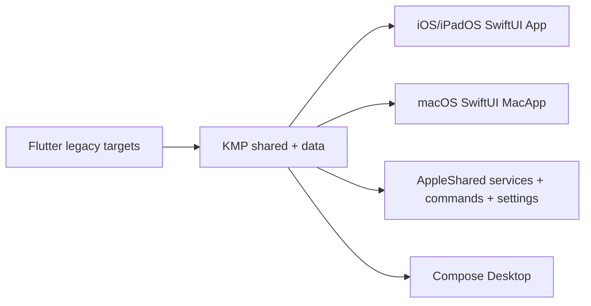
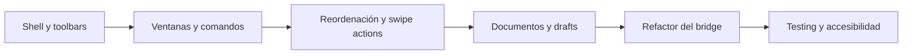

# SwiftUI 27 en Apple Platforms y hoja de ruta para Mi Gestor Evaluaciones

## Resumen ejecutivo

La expresión “SwiftUI 27” no es el nombre formal de un framework separado, sino la forma práctica de referirse a las novedades de SwiftUI que Apple está entregando en el ciclo 2027 de sus plataformas y SDKs. La guía oficial de WWDC26 resume ese ciclo como una actualización fuerte de SwiftUI con una nueva API de documentos, controles de toolbar más finos y mejoras relevantes en rendimiento, tiempos de compilación y flujo de datos; la sesión oficial “What’s new in SwiftUI” añade reordenación por drag and drop en contenedores arbitrarios, mejoras en toolbars, nuevas alertas, soporte ampliado para swipe actions y trabajo renovado en apps document-based. Varias páginas de documentación marcan estas API como beta de iOS 27/macOS 27, así que conviene tratarlas como superficie en consolidación hasta la versión final del SDK. citeturn15search6turn15search5turn19view0

La línea de diseño de Apple para iPadOS, macOS e iOS en este ciclo es todavía más clara que en años anteriores: menos chrome personalizado, más semántica del sistema. En la práctica eso significa usar escenas nativas, toolbars del sistema, menú de menubar cuando el dispositivo lo soporta, placer por la búsqueda colocada en toolbar, controles que respondan bien a teclado, puntero y accesibilidad, y una jerarquía visual basada en materiales y comportamientos nativos en lugar de superficies “dibujadas a mano”. Apple lo refuerza en HIG y sesiones recientes: el menú de menubar mejora descubribilidad y accesibilidad; en iPadOS siguen siendo clave el redimensionado de ventanas, los Window Controls, un puntero más preciso y la menubar; y el HIG para pointing devices subraya comportamientos por hover en toolbars minimizadas y otros elementos del sistema. citeturn23search16turn24search0turn24search1turn24search3turn24search4

Para **mafepa21/mi_gestor_evaluaciones**, la buena noticia es que el repositorio ya está bastante mejor posicionado que muchos proyectos SwiftUI típicos: el producto Apple activo ya se describe como **KMP + SwiftUI**; hay targets nativos separados para iOS/iPadOS y macOS; existen `NavigationSplitView`, escenas `Settings`, comandos con atajos de teclado, persistencia de estado con `AppStorage` y `SceneStorage`, foco explícito en macOS, y una capa visual propia basada en materiales. La mala noticia es que el salto a una experiencia “premium” con SwiftUI 27 todavía no está hecho: en los entry points y shells inspeccionados no aparece adopción visible de las nuevas API de toolbar de SwiftUI 27, ni de `reorderContainer`, ni de `swipeActionsContainer`, ni de la nueva capa de documentos; además, el `KmpBridge` centraliza una cantidad muy grande de estado publicado, lo que sugiere una superficie de invalidación y acoplamiento mayor de la deseable. citeturn31view2turn33view0turn36view0turn38view5turn38view7turn43view3turn44view0turn44view4turn45view1turn45view3turn48view0

Mi conclusión práctica es esta: el repo ya tiene base suficiente para una modernización seria, pero el trabajo que más retorno dará no es “añadir más vistas”, sino **modernizar shell, escenas, toolbars, búsqueda, reordenación, documentos y arquitectura del estado**. Si se hace bien, el resultado puede parecer mucho más cercano a una app Apple-first de productividad avanzada que a una migración parcial desde Flutter. citeturn15search6turn24search0turn31view2turn33view1turn45view1

## Qué cambia en SwiftUI 27

La guía oficial de WWDC26 y la sesión principal de SwiftUI describen cuatro bloques especialmente importantes para macOS, iPadOS e iOS. El primero es **document workflows**: Apple introduce una nueva familia de protocolos y tipos para documentos con acceso más directo al disco y diffing basado en snapshots, incluyendo `ReadableDocument`, `WritableDocument`, `DocumentReader`, `DocumentWriter`, `FileWrapperDocumentReader`, `FileWrapperDocumentWriter`, `URLDocumentConfiguration` y soporte renovado en `fileExporter`. El segundo es **reordering**: SwiftUI ya no limita el drag to reorder a las construcciones antiguas; ahora lo expande mediante `reorderable()` y `reorderContainer(...)` para listas, stacks, grids y layouts personalizados. El tercero es **toolbar modernization** con `ToolbarOverflowMenu`, `topBarPinnedTrailing`, `visibilityPriority(_:)` y comportamiento de auto-minimización. El cuarto es la ampliación de **interaction surfaces**, con `swipeActionsContainer()` para contenedores arbitrarios dentro de `ScrollView`, nuevos overloads de `alert(...)` y mejoras en carga y caché de imágenes con `AsyncImage(request:scale:)`. citeturn15search5turn15search6turn19view0turn22search6turn3search0turn3search1turn3search2turn3search3turn5search0

En rendimiento y flujo de datos, Apple está afinando dos cosas distintas. Por un lado, la propia guía oficial habla de mejoras significativas en **build times** y **data flow**; por otro, el cambio de `@State` a macro en Xcode 27 permite **evaluación perezosa** del valor inicial para modelos `@Observable`, eliminando inicializaciones redundantes cuando la view struct se recrea. Además, las sesiones de UI Frameworks de WWDC26 siguen insistiendo en que la fluidez de `LazyVStack` y layouts complejos depende de evitar cambios tardíos de layout o trabajo costoso disparado en `onAppear`. citeturn15search6turn20view3turn13search3turn19view1turn46search2

Desde la perspectiva multiplataforma, lo más relevante no es una “gran API mágica”, sino una convergencia: SwiftUI se acerca más a flujos de trabajo serios en desktop y iPad. Eso se nota en escenas, toolbars, comandos, búsqueda, reordenación, documentos y mejor interoperabilidad con AppKit/UIKit, un foco explícito del catálogo de sesiones de WWDC26. Dicho de otra manera: Apple está empujando a SwiftUI a territorio “pro app”, no sólo “consumer UI”. citeturn13search3turn15search6turn20view0

### Matriz de novedades con impacto práctico

| Área | Novedad | Impacto real para tu app |
|---|---|---|
| Documentos | `ReadableDocument` / `WritableDocument` / readers-writers / snapshots | Muy alto para backups, exportación, drafts, informes y restore |
| Reordenación | `reorderable()` + `reorderContainer(...)` | Muy alto para cuaderno, columnas, rúbricas, bloques y listas docentes |
| Toolbars | `ToolbarOverflowMenu`, `topBarPinnedTrailing`, `visibilityPriority` | Muy alto en iPad y Mac para toolbar más estable y profesional |
| Gestos y acciones | `swipeActionsContainer()` | Alto en iPad/iPhone para grids y listas custom fuera de `List` |
| Alertas | nuevos overloads `alert(error:...)` e `item`-based | Medio; mejora coherencia y modelado de errores |
| Imágenes/red | `AsyncImage(request:)` y caché HTTP estándar | Medio; útil si añades avatares, capturas, adjuntos o previews |
| Estado | `@State` macro con init perezosa para `@Observable` | Alto si fragmentas `KmpBridge` en feature stores |
| Persistencia | SwiftData con `ResultsObserver` y `HistoryObserver` | Alto para drafts, histórico, sync y side effects fuera de vistas |

La lectura anterior sintetiza la guía oficial de SwiftUI 2027, la sesión “What’s new in SwiftUI”, la documentación beta de símbolos nuevos y las sesiones de SwiftData y rendimiento. citeturn15search6turn15search5turn19view0turn46search0turn46search2

## Diseño de plataforma según HIG y WWDC

La decisión de diseño más importante para una app educativa compleja en 2026–2027 no es estética, sino estructural: **dejar que la plataforma haga más trabajo**. En macOS e iPadOS, Apple recomienda que los comandos importantes estén presentes en la menubar, porque allí son más descubribles, más accesibles y más compatibles con atajos de teclado. En iPadOS, Apple sigue empujando una experiencia más “desktop-class” con redimensionado de ventanas, Window Controls, menubar y un puntero más preciso, que en la práctica empuja a diseñar shells con una jerarquía clara de sidebar, toolbar, inspector y detail pane en vez de apilar pestañas o overlays arbitrarios. citeturn23search16turn23search2turn23search8turn24search0turn24search1

Eso tiene consecuencias concretas para tipografía, spacing y controles. Apple no está diciendo “usa 8 puntos” en un vacío; está diciendo “usa métricas, materiales y tamaños del sistema para que los controles se sientan nativos y legibles”. En tu repo ya existe una guía interna de diseño desktop que fija una geometría de 8 pt, microinteracciones y superficies “glass”, lo que encaja bien con el objetivo de consistencia; pero la recomendación para SwiftUI 27 no es exagerar la customización, sino **reducirla a una capa de diseño sistemática** por encima de toolbar, split view, search, menu y materiales del sistema. citeturn31view1turn48view0turn24search0

En puntero y gestos, el HIG es muy claro: en iPadOS, el puntero puede revelar toolbars minimizadas y otros affordances al hover; y los context menus deben funcionar tanto con long press como con secondary click. Para una app como Mi Gestor Evaluaciones esto importa mucho porque una parte sustancial del valor “premium” no vendrá del color o del blur, sino de que **todo responda bien a dedo, trackpad, teclado y VoiceOver**. citeturn24search3turn24search4turn13search1turn46search1

En accesibilidad, la línea más fuerte de Apple este año no es sólo “añade labels”, sino revisar controles personalizados para VoiceOver, acciones, passthrough gesture y direct touch. En tu caso eso afecta sobre todo al cuaderno, a celdas editables, grids, inspectores laterales, builders de rúbricas y barras de comando propias. Si esas superficies no se vuelven accesibles de forma explícita, la app puede verse sofisticada pero seguirá estando por debajo del estándar Apple real. citeturn46search1turn13search1

### Traducción de HIG a decisiones concretas para esta app

| Tema | Decisión recomendable |
|---|---|
| Tipografía | Priorizar estilos del sistema y pesos semánticos; evitar jerarquías tipográficas “dibujadas” a mano |
| Spacing | Mantener una retícula consistente; la guía interna de 8 pt es una buena base para shells y cards |
| Controls | Favorecer `Button`, `Toggle`, `Menu`, `Picker`, `TextField`, `searchable`, `ToolbarItem` antes que controls custom sin necesidad |
| Windowing | En macOS, abrir ventanas auxiliares reales para inspector, informes y sync en vez de meter todo en sheets |
| Multitasking | En iPadOS, optimizar `NavigationSplitView`, toolbar y búsqueda para Stage Manager y teclado |
| Gestures | Usar swipe actions y drag-to-reorder sólo donde mejoren la tarea principal, no como adorno |
| Toolbars y menus | Mover acciones secundarias a overflow/menu; reservar visibilidad principal para guardar, sync, búsqueda y contexto |
| Focus | Dar prioridad a foco, atajos y navegación por teclado en notebook, asistencia y rúbricas |
| Pointer | Añadir affordances por hover sólo donde mejoren descubribilidad y precisión |
| Accesibilidad | Tratar cada control custom como candidato a etiqueta, hint, action y representación accesible |

La tabla resume cómo aterrizar HIG y WWDC en una app de productividad docente con shell multiplataforma. citeturn23search16turn24search0turn24search3turn24search4turn46search1turn31view1


La arquitectura visual que más se alinea con Apple este ciclo es exactamente esa secuencia: escenas, split view, toolbar, menús, búsqueda, inspector y accesibilidad; no una superposición caótica de panes y acciones. citeturn24search0turn23search16turn46search1

## Implementación paso a paso en macOS e iPadOS

### Escenas, ventanas y menús en macOS

El repositorio ya usa `WindowGroup` y `Settings` en macOS, y además inyecta `ToolbarCommands()` y `AppleAppCommands()` en la escena principal. Eso es una base correcta, pero todavía no explota bien el modelo de ventanas auxiliares de SwiftUI: en el entry point inspeccionado sólo aparece una ventana principal y una escena de ajustes. Para una app “premium”, yo abriría ventanas reales para inspector, informes y centro de sincronización, con tamaño y atajos dedicados. citeturn43view0turn43view1turn43view3turn43view5

```swift
import SwiftUI

@main
struct MiGestorPremiumMacApp: App {
    var body: some Scene {
        WindowGroup("MiGestor") {
            MacRootView()
        }
        .defaultSize(width: 1280, height: 820)
        .defaultPosition(.center)

        Window("Inspector", id: "inspector") {
            InspectorView()
        }
        .defaultSize(width: 420, height: 720)
        .keyboardShortcut("0", modifiers: [.command, .option])

        Window("Informes", id: "reports") {
            ReportsView()
        }
        .defaultSize(width: 920, height: 760)

        Settings {
            SettingsView()
        }
    }
}
```

La parte new-school aquí no es el snippet en sí, sino el criterio: cada flujo pesado merece escena propia. `defaultSize`, `defaultPosition`, scene-level `keyboardShortcut` y `openWindow` siguen siendo la manera correcta de hacer que una app de Mac se sienta de verdad como app de Mac. citeturn23search3turn23search9turn23search13turn23search15

También conviene mantener todo comando importante en la menubar, no sólo en toolbar:

```swift
.commands {
    ToolbarCommands()

    CommandMenu("Cuaderno") {
        Button("Buscar") { /* trigger search */ }
            .keyboardShortcut("f", modifiers: .command)

        Button("Reordenar columnas") { /* open reorder flow */ }
            .keyboardShortcut("r", modifiers: [.command, .option])
    }

    CommandMenu("Navegación") {
        Button("Ir al Cuaderno") { /* navigate */ }
            .keyboardShortcut("1", modifiers: .command)
        Button("Ir a Asistencia") { /* navigate */ }
            .keyboardShortcut("2", modifiers: .command)
    }
}
```

Esto está muy alineado con lo que ya hace el repo en `AppleAppCommands`, donde se ve `CommandGroup`, `CommandMenu` y varios `keyboardShortcut` explícitos. La recomendación aquí no es inventar otro sistema, sino **subir a menubar y Commands las acciones verdaderamente globales**. citeturn39view4turn39view5turn39view6turn23search16

### Toolbars modernas en iPadOS e iOS

SwiftUI 27 introduce un control bastante mejor del top bar. La traducción práctica es sencilla: deja de intentar que todo quepa siempre visible, y declara explícitamente qué acción debe permanecer arriba, cuál puede ir a overflow y cuál tiene prioridad alta. citeturn19view0turn3search0turn3search1turn3search2turn3search3

```swift
struct EvaluationsShellView: View {
    var body: some View {
        NavigationStack {
            EvaluationListView()
                .toolbar {
                    ToolbarItem(placement: .topBarPinnedTrailing) {
                        SyncStatusBadge()
                    }

                    ToolbarItem {
                        Button("Guardar") { saveChanges() }
                    }
                    .visibilityPriority(.high)

                    ToolbarItem {
                        Button("Buscar") { presentSearch() }
                    }
                    .visibilityPriority(.high)

                    ToolbarOverflowMenu {
                        Button("Exportar informe") { exportReport() }
                        Button("Reordenar columnas") { startReordering() }
                        Button("Mostrar columnas ocultas") { showHiddenColumns() }
                    }
                }
        }
    }

    private func saveChanges() {}
    private func presentSearch() {}
    private func exportReport() {}
    private func startReordering() {}
    private func showHiddenColumns() {}
}
```

Ese patrón cuadra especialmente bien con tu cuaderno, porque hoy el repo ya tiene toolbars contextuales y un shell con `NavigationSplitView`; el salto premium consiste en **descongestionar la toolbar** y modelar mejor acciones primarias y secundarias. En los root shells actuales he visto toolbar contextual, pero no la adopción visible de `ToolbarOverflowMenu`, `topBarPinnedTrailing` o `visibilityPriority(_:)`. citeturn38view0turn38view2turn44view4turn19view0

### Layout adaptativo, búsqueda y foco

El repo ya está haciendo varias cosas bien. En iOS/iPadOS hay un shell con `NavigationSplitView`, estado persistido en `SceneStorage` y `AppStorage`, toolbar contextual y presentación de sheets/full-screen cover. En el iPad shell además aparece `.searchable(..., placement: .toolbar, ...)`, que es justo la dirección correcta para una app de productividad. En macOS, el root usa `NavigationSplitView`, toolbars con IDs, un toggle de sidebar y `@FocusState` para el search field del notebook. citeturn41view0turn38view5turn38view7turn44view0turn44view4

```swift
struct WorkspaceShell: View {
    @State private var query = ""
    @State private var splitVisibility: NavigationSplitViewVisibility = .all
    @FocusState private var searchFocused: Bool

    var body: some View {
        NavigationSplitView(columnVisibility: $splitVisibility) {
            SidebarView()
                .navigationSplitViewColumnWidth(min: 220, ideal: 260)
        } detail: {
            DetailWorkspaceView()
        }
        .searchable(
            text: $query,
            placement: .toolbar,
            prompt: "Buscar alumnado, rúbricas o sesiones"
        )
        .toolbar {
            ToolbarItem(placement: .navigation) {
                Button {
                    splitVisibility = splitVisibility == .all ? .detailOnly : .all
                } label: {
                    Label("Barra lateral", systemImage: "sidebar.leading")
                }
            }
        }
    }
}
```

Para macOS, yo haría dos ajustes concretos. Primero, localizaría el foco de búsqueda de forma consistente para que `⌘F` siempre lleve a un único campo activo por módulo. Segundo, evitaría construir búsquedas separadas y “ad hoc” por feature cuando muchas pueden compartir un modelo de consulta global por escena. La sesión de diseño de búsqueda y la HIG convergen en una idea simple: la búsqueda es una herramienta de navegación de primer orden, no una cajita más en una toolbar. citeturn38view7turn44view1turn39view4turn13search3

### Reordenación y swipe actions fuera de List

Esta es una de las mejores noticias de SwiftUI 27 para tu producto. Tu dominio tiene muchísimos objetos reordenables: columnas del cuaderno, bloques de evaluación, rúbricas, listas rápidas, secuencias de sesiones y quizá seating plans. SwiftUI 27 te da por fin una vía oficial para reordenar en stacks, grids y layouts propios con `reorderable()` y `reorderContainer(...)`. Y, por separado, amplía `swipeActions` a contenedores arbitrarios mediante `swipeActionsContainer()`. citeturn22search6turn22search0turn22search3turn19view0turn20view6

```swift
@available(iOS 27.0, macOS 27.0, *)
struct ReorderableColumnsView: View {
    @State private var columns: [EvaluationColumn] = []

    var body: some View {
        LazyVStack(alignment: .leading, spacing: 12) {
            ForEach(columns) { column in
                ColumnRow(column: column)
                    .reorderable()
            }
        }
        .reorderContainer(for: EvaluationColumn.self) { difference in
            // Traduce aquí `difference` a tu fuente de verdad.
            // No inventes helpers; ajusta la firma exacta al SDK final.
        }
    }
}

struct EvaluationColumn: Identifiable {
    let id: UUID
    let title: String
}
```

La decisión importante no es sólo “usar la API nueva”, sino **elevar el orden a dato persistente**. Si el profesor reordena columnas, ese orden debe persistir, sincronizarse y entrar en tests. citeturn22search0turn19view0turn46search0

```swift
@available(iOS 27.0, *)
struct TaskListView: View {
    @State private var tasks: [TaskRowModel] = []

    var body: some View {
        ScrollView {
            LazyVStack {
                ForEach(tasks) { task in
                    TaskRow(task: task)
                        .swipeActions(edge: .leading) {
                            Button("Completar") { complete(task) }
                        }
                        .swipeActions(edge: .trailing) {
                            Button("Eliminar", role: .destructive) { delete(task) }
                        } onPresentationChanged: { isPresented in
                            // Opcional: registrar qué fila tiene acciones abiertas
                        }
                }
            }
        }
        .swipeActionsContainer()
    }

    private func complete(_ task: TaskRowModel) {}
    private func delete(_ task: TaskRowModel) {}
}
```

Este patrón es especialmente valioso en iPadOS porque te permite abandonar `List` cuando necesitas layouts más ricos sin perder affordances estándar. citeturn20view6turn20view5turn19view0

### Estado, persistencia, testing y accesibilidad

Tu repo ya tiene una capa `KmpBridge` en `@MainActor` y `ObservableObject`, con muchísimas propiedades `@Published` y referencias a varios view models KMP. Eso funciona, pero también sugiere que una gran parte del invalidation work de la app depende de una única raíz observable. SwiftUI 27 mejora el caso `@Observable` + `@State`, así que mi recomendación es dividir el bridge en stores de feature y usar `@State` para el ownership local de modelos observables donde corresponda. citeturn45view1turn45view3turn20view3

```swift
import Observation
import SwiftUI

@Observable
final class AttendanceSession {
    var selectedClassID: Int64?
    var query: String = ""
    var isSyncing = false
}

struct AttendanceView: View {
    @State private var session = AttendanceSession()

    var body: some View {
        AttendanceWorkspace(session: session)
    }
}
```

La persistencia también merece otro escalón. Apple está empujando SwiftData con `ResultsObserver` y `HistoryObserver` para reaccionar a cambios del store fuera de la vista. Para esta app eso encaja muy bien con drafts, autosave local, histórico de cambios, cola de sync y observación de resultados para side effects de escritorio. Aunque no te recomendaría reemplazar KMP data de golpe, sí introducir **SwiftData en la periferia Apple** para estado puramente local de UX. citeturn46search0

```swift
import SwiftData

@Model
final class EvaluationDraft {
    var id: UUID
    var title: String
    var updatedAt: Date

    init(id: UUID = UUID(), title: String, updatedAt: Date = .now) {
        self.id = id
        self.title = title
        self.updatedAt = updatedAt
    }
}
```

En testing, Apple sigue empujando `Swift Testing` como camino de modernización, no necesariamente sustitución inmediata de todo XCTest. Para esta app, los primeros tests que migraría serían: persistencia del orden de columnas, shortcuts globales, restauración de escena, selección de clase/alumno, sync banner, visibilidad del inspector y accesibilidad de celdas/acciones. citeturn46search4turn46search3

```swift
import Testing

@Test
func reorderingColumnsPersistsStableIDs() async throws {
    // Arrange: crea columnas y aplica el cambio de orden
    // Assert: el orden persistido mantiene identidad estable
}
```

Y en accesibilidad, el mensaje de Apple es directo: los controles personalizados deben exponer intención, no sólo visual. En una app con grids y celdas editables, cada acción principal debería tener label, hint y, cuando haga falta, action accesible adicional. citeturn46search1

```swift
Button {
    saveEvaluation()
} label: {
    Label("Guardar", systemImage: "square.and.arrow.down")
}
.accessibilityLabel("Guardar evaluación")
.accessibilityHint("Sincroniza cambios y crea una copia local")
.accessibilityAction(named: "Guardar ahora") {
    saveEvaluation()
}
```

## Análisis del repositorio mafepa21/mi_gestor_evaluaciones

El repositorio describe una evolución explícita desde una app Flutter hacia una arquitectura **KMP + SwiftUI**. El `README` general y el `README` de `kmp/` sitúan a la variante Apple como producto activo principal, con `kmp/shared/` para dominio y view models, `kmp/data/` para SQLDelight y repositorios, `kmp/iosApp/App/` para iOS/iPadOS, `kmp/iosApp/MacApp/` para macOS y `kmp/iosApp/AppleShared/` para servicios y componentes Apple compartidos. La baseline del proyecto también documenta esa estructura como fotografía canónica del estado actual. citeturn31view2turn32view0turn31view0turn28view0



Arquitectónicamente, eso es una decisión razonable: dominio y datos compartidos, shell nativo por plataforma. El riesgo real no está en la arquitectura macro, sino en la forma en que la capa Apple conecta con KMP. El `iosApp/README` dice que la conexión se centraliza en `KmpBridge.swift`, manteniendo `KmpBridge.swift` como archivo sensible para consumir estados y flows del shared module. Al inspeccionar ese archivo se ve un `KmpBridge` en `@MainActor` que publica un volumen muy alto de estado: clases, asignaturas, alumnado, evaluaciones, rúbricas, planning, estado de cuaderno, estado de evaluación por rúbrica, dashboard, sync LAN, sheets y más; además mantiene referencias a varios view models KMP internamente. Eso es funcional, pero sugiere un **mega-adapter** con acoplamiento elevado. La inferencia aquí es importante: no es que esté “mal”, pero sí que es el principal cuello de botella arquitectónico para una SwiftUI 27 más fina. citeturn33view0turn45view1turn45view3

En iOS/iPadOS, el app entry point es limpio: `MiGestorKMPiOSApp` usa `WindowGroup`, delega en `AppleAppRootView(themeMode:)`, observa `scenePhase` y publica notificaciones de ciclo de vida; además inyecta `.commands { AppleAppCommands() }`. En el shell de iOS se aprecia una base buena para una app multipanel: `NavigationSplitView`, `SceneStorage` y `AppStorage` para estado persistente, toolbar contextual, overlay de banners, `sheet(item:)`, full screen cover para el builder de rúbricas y tareas de carga inicial contra el bridge. En el shell específico de iPad aparece además `NavigationSplitView` con `.searchable(... placement: .toolbar ...)`, que es exactamente la clase de decisión correcta para un flujo productivo. citeturn36view0turn41view0turn38view5turn38view7

En macOS, el entry point usa `WindowGroup("MiGestor")`, `ToolbarCommands()`, `AppleAppCommands()` y una `Settings` scene. En `MacRootView` sí hay patrones desktop serios: `NavigationSplitView`, toolbar con IDs, botón de toggle de sidebar, inspector visible/oculto, `@FocusState` para la búsqueda del notebook y atajos de teclado explícitos. También es interesante que la app tenga una capa visual propia en `MacLiquidGlassStyle.swift`, basada en materiales del sistema como `.regularMaterial`, `.thinMaterial` y variaciones según estado activo. Esto es una fortaleza: el proyecto ya intenta hablar el lenguaje visual del sistema en vez de dibujar un desktop falso. citeturn43view0turn43view3turn43view5turn44view0turn44view1turn44view4turn48view0

Dicho eso, hay tres brechas evidentes si el objetivo es “premium con SwiftUI 27”. La primera es **windowing**: en los archivos inspeccionados sólo he encontrado una ventana principal y ajustes, no un modelo de ventanas auxiliares real para inspector, informes o centro de sincronización, pese a que la app lo pide por dominio. La segunda es **adopción de superficie SwiftUI 27**: en los shells principales se ven split views, toolbars y commands, pero no la adopción visible de `ToolbarOverflowMenu`, `visibilityPriority`, `topBarPinnedTrailing`, `reorderContainer`, `swipeActionsContainer` o la nueva API de documentos. La tercera es **arquitectura del estado**: el bridge central ya parece demasiado ancho para seguir creciendo sin pagar coste en invalidaciones, previews, testabilidad y acoplamiento. Estas son conclusiones de alto nivel a partir de los entry points y shells inspeccionados; no equivalen a una búsqueda exhaustiva de cada archivo del repo. citeturn43view0turn43view1turn43view3turn44view4turn45view1turn45view3

### Tabla comparativa entre SwiftUI 27 y el estado visible del repo

| Característica o novedad | ¿Presente? | Nivel de implementación | Recomendación priorizada |
|---|---|---|---|
| `NavigationSplitView` en shells principales | Sí | Alta | Mantener y refinar; es una muy buena base |
| Persistencia de escena con `AppStorage` / `SceneStorage` | Sí | Alta | Conservar; extender a más contexto por escena |
| Menús y atajos con `Commands` | Sí | Alta | Consolidar como sistema global de acciones |
| Búsqueda en toolbar del iPad shell | Sí | Media-alta | Unificarla con foco, resultados y navegación |
| Foco explícito en búsqueda del notebook macOS | Sí | Media | Mejorar con routing global de `⌘F` |
| Materiales/estilo visual de sistema en macOS | Sí | Media | Reducir custom visual innecesaria y alinear más con materiales nativos |
| `ToolbarOverflowMenu`, `visibilityPriority`, `topBarPinnedTrailing` | No visible en archivos inspeccionados | Baja | Prioridad alta |
| `reorderContainer(...)` / `reorderable()` | No visible en archivos inspeccionados | Baja | Prioridad alta en cuaderno y rúbricas |
| `swipeActionsContainer()` fuera de `List` | No visible en archivos inspeccionados | Baja | Prioridad media-alta |
| Nueva API de documentos (`ReadableDocument` / `WritableDocument`) | No visible en archivos inspeccionados | Baja | Prioridad alta para backups, drafts e informes |
| Ventanas auxiliares macOS con `Window`, `defaultSize`, `defaultPosition` | Parcial | Baja | Prioridad alta |
| Bridge observable fragmentado por feature | Parcial | Baja-media | Prioridad alta |
| SwiftData observers para estado local Apple | No visible en archivos inspeccionados | Baja | Prioridad media |
| Swift Testing moderno | No concluyente con la inspección realizada | Indeterminado | Prioridad media |

La tabla está basada en el `README`, la baseline, `iosApp/README`, los entry points de iOS y macOS, `AppleAppCommands`, `MacRootView`, `IOSRootView`, `IPadWorkspaceShell`, `KmpBridge` y `MacLiquidGlassStyle`. citeturn31view2turn31view0turn33view0turn36view0turn41view0turn38view5turn39view4turn44view0turn44view4turn45view1turn48view0

## Plan de trabajo priorizado

La secuencia que más sentido tiene no es “migrar todo a la vez”, sino atacar primero la capa que el usuario percibe más y que además allana el resto. En otras palabras: **shell primero, datos después, refinamiento al final**. citeturn15search6turn24search0turn31view2turn45view1

| Tarea | Impacto | Esfuerzo | Prioridad |
|---|---|---|---|
| Modernizar toolbars con overflow, prioridades y pinned actions | Muy alto | Mediano | Muy alta |
| Añadir ventanas auxiliares reales en macOS | Muy alto | Mediano | Muy alta |
| Adoptar reordenación oficial SwiftUI 27 en notebook y rúbricas | Muy alto | Alto | Muy alta |
| Introducir `swipeActionsContainer()` en listas/grids custom del iPad | Alto | Mediano | Alta |
| Fragmentar `KmpBridge` en feature stores observables | Muy alto | Alto | Muy alta |
| Añadir workflow document-based para backup, export y drafts | Muy alto | Alto | Muy alta |
| Unificar búsqueda, foco y shortcut routing entre Mac/iPad | Alto | Mediano | Alta |
| Crear capa SwiftData local para drafts/historial Apple-only | Alto | Mediano | Alta |
| Migrar la suite nueva a Swift Testing | Medio-alto | Mediano | Media-alta |
| Auditoría completa de accesibilidad en controles custom | Muy alto | Mediano | Muy alta |
| Pulido de puntero, hover y context menus | Medio-alto | Bajo-mediano | Media-alta |

Una forma razonable de organizarlo es la siguiente:



### Qué haría primero, de forma muy concreta

Primero, consolidaría una **toolbar strategy por plataforma**. En iPad y iPhone: guardar, buscar y sync como acciones primarias; overflow para exportar, reorganizar columnas y acciones menos frecuentes. En Mac: toolbar principal corta, inspector y sidebar siempre disponibles, y la menubar como complemento, no como duplicado confuso. Esto tiene retorno inmediato sobre claridad, densidad visual y percepción de calidad. citeturn19view0turn39view4turn39view5turn44view4

Segundo, abriría de verdad el modelo de **escenas de macOS**. Inspector, backup center, reports y quizá command center deberían poder vivir en ventanas propias, no sólo en sheets o paneles locales. El dominio de la app lo justifica y Apple lleva varias versiones empujando precisamente esa experiencia. citeturn23search3turn23search15turn43view0turn43view1

Tercero, llevaría SwiftUI 27 al core del producto allí donde más duele hoy: **cuaderno y rúbricas**. La combinación de `reorderContainer(...)`, búsqueda bien integrada, foco firme, toolbar priorizada y acciones por swipe en layouts custom puede convertir el cuaderno en el equivalente real a una “pro app” educativa para iPad y Mac. citeturn22search6turn19view0turn20view6turn38view7turn44view1

Cuarto, empezaría a dividir el bridge por dominios: notebook, attendance, rubrics, dashboard, sync, backups. SwiftUI 27 no te obliga a hacerlo, pero las mejoras de `@State` + `@Observable` hacen más rentable esa división, y la sesión de rendimiento de Apple va exactamente en la dirección de entender y reducir causas de actualización. citeturn20view3turn46search2turn45view1

Quinto, cerraría el trabajo con **testing y accesibilidad**, no como “última hora”, sino como criterio de premium. Si la app termina teniendo muchos controles custom y layouts complejos, la regresión fácil será foco, teclado, VoiceOver y side effects de toolbar/scene. Justo ahí es donde una suite en Swift Testing y una auditoría de accesibilidad bien pensada amortizan más. citeturn46search4turn46search1turn13search1

## Limitaciones y preguntas abiertas

Las API de SwiftUI 27 citadas aquí proceden en parte de documentación y sesiones publicadas durante WWDC26 y, en varios casos, marcadas como beta para iOS 27/macOS 27. La dirección técnica es muy clara, pero algunas firmas exactas todavía pueden moverse antes del SDK final; por eso he separado con cuidado las recomendaciones firmes de los esqueletos de implementación que conviene revalidar en Xcode 27 final. citeturn15search6turn19view0

El análisis del repositorio es sólido a nivel de arquitectura, entry points, shells principales, commands y capa de bridge, pero no es una auditoría exhaustiva línea por línea de todos los ficheros Swift del monorepo. En particular, las afirmaciones del tipo “no visible en los archivos inspeccionados” significan exactamente eso: **no he encontrado evidencia en los entry points y shells clave revisados**, no una prueba absoluta de ausencia en todo el árbol. citeturn31view2turn33view0turn36view0turn37view0turn37view1turn37view2turn36view3

La gran pregunta abierta, estratégicamente, no es técnica sino de producto: cuánto del estado local Apple debería vivir en KMP y cuánto merece una capa SwiftData o Swift-only para UX avanzada. Mi recomendación, con la evidencia vista, es una respuesta híbrida: **KMP para dominio y persistencia transversal; SwiftData/SwiftUI para drafts, escenas, ventanas, búsqueda, histórico local y ergonomía Apple-only**. Esa separación sería compatible con la dirección oficial de Apple y con la estructura ya descrita en el propio repositorio. citeturn32view0turn33view0turn46search0