# Plan de diseño: entregas del alumnado vía web (PWA) hacia Mi Gestor Evaluaciones (2026-07-29)

## 1. Objetivo

Permitir que el alumnado complete desde el navegador los materiales de `03_ALUMNADO` de las
Situaciones de Aprendizaje (pasaportes, portfolios, coevaluaciones, fichas de diagnóstico) y que
esas respuestas lleguen a Mi Gestor Evaluaciones **como respuestas de instrumento ya existentes**,
sin sistema de evaluación paralelo, sin nombres del alumnado en un servidor de terceros y sin
notas calculadas fuera de la app.

Alcance de este documento: contrato de datos, criptografía, componentes nuevos y plan de pilotos.
No incluye la implementación.

### No objetivos

- No se expone el Mac a Internet.
- No se sustituye SyncLAN ni el Cuaderno.
- No se calcula ninguna nota en el navegador ni en el servidor.
- No hay vídeo en el primer piloto.

---

## 2. Lo que ya existe (verificado en código, 2026-07-29)

| Pieza | Ubicación | Estado |
|---|---|---|
| Plantillas de instrumento | `notebook_instrument_templates`, `AppDatabase.sq:674` | Existe |
| Ítems de instrumento | `notebook_instrument_items` | Existe |
| Respuestas por clase/alumno/columna/ítem | `notebook_instrument_responses` | Existe |
| Pruebas físicas y sus intentos | `physical_test_results`, `physical_test_attempts`, `AppDatabase.sq:2134` | Existe |
| Punto de entrada correcto para guardar respuestas | `NotebookInstrumentsRepositorySqlDelight.saveResponses`, línea 161 | Existe |
| Servidor local LAN (HTTPS + token + fingerprint) | `kmp/data/src/desktopMain/.../sync/LocalSyncServer.kt` | Existe, **no se toca** |
| Patrón de ingesta desde SyncLAN | `kmp/iosApp/App/KmpBridge.swift:10621` | Existe, **se replica** |

### Tipos de ítem soportados (contrato real, no ampliable desde la web)

`NotebookInstrumentItemType` en `kmp/shared/.../domain/Models.kt:1425`:

```
CHECK, TEXT, NUMBER, SCALE_1_4, CHOICE
```

Son **cinco**. Cualquier control del formulario web debe reducirse a uno de estos cinco. Si un
material de `03_ALUMNADO` pide algo que no encaja, se rediseña el material, no el contrato.

### Derivación automática de nota: qué hay y qué no

`saveResponses` deriva nota en este orden y para nada más:

1. `deriveObservationGridScore` — ítems `SCALE_1_4` con clave `obs_s<N>_i<M>`.
2. `deriveProportionalChecklistScore` — ítems `CHECK` con clave `chkp_<n>`, nota = marcados / total × 10.

**No existe derivación de % de aciertos de quiz.** Y `QuizQuestionDraft`
(`LearningSituationAssessmentInstrumentsImportService.swift:167`) solo guarda `questionText` y
`options`: no hay clave de respuesta correcta en el modelo. Ver bloque 9.

---

## 3. Principios de diseño (no negociables)

1. **Nunca `INSERT` directo en `notebook_instrument_responses`.** Toda entrada pasa por
   `saveResponses`, que además resume el estado (`0/7`, `5/7`, `Completo`), escribe
   `display_value` en la celda, deriva y persiste la nota vía `gradesRepository.saveGrade`,
   invalida `sheetCache` y emite `NotebookRefreshBus`. Un `INSERT` deja la respuesta en la base
   de datos sin nota, sin resumen y sin refresco del Cuaderno.
2. **Una sola llamada a `saveResponses` por celda y entrega**, con la entrega completa, igual que
   hace el puente de iOS al recibir una respuesta de SyncLAN.
3. **El Mac tira, nadie empuja al Mac.** El servidor local sigue siendo solo LAN. La bandeja de
   entrega es un cliente saliente.
4. **La nube no conoce identificadores reales.** Ni `studentId`, ni `classId`, ni `columnId`, ni
   `itemId` locales.
5. **Cifrado extremo a extremo con clave que nunca llega al servidor.**
6. **Alias por actividad, nunca permanentes.** Un alumno tiene un alias distinto en cada
   formulario, así que dos entregas no se pueden cruzar entre sí.
7. **Idempotencia por `submissionId`.** Reimportar dos veces no duplica ni sobreescribe a ciegas.
8. **Previsualización obligatoria antes de escribir**, como el resto de importadores de la app.
9. **La app calcula, el navegador no.** Cualquier nota que llegue desde la web se descarta.

---

## 4. Arquitectura

```mermaid
flowchart LR
    A["Mi Gestor (Mac)"] -->|"Manifiesto firmado, sin ids reales"| B["PWA en Vercel"]
    B -->|"Sobre cifrado + alias de actividad"| C["Bandeja en Supabase"]
    C -->|"Pull saliente"| D["CloudSubmissionInbox (desktopMain)"]
    D -->|"Descifra, resuelve alias, valida tipos"| E["Previsualización"]
    E -->|"saveResponses (1 llamada por celda)"| F["Cuaderno + nota derivada"]
    F --> G["SyncLAN -> iPad"]
```



### Reparto de responsabilidades

| Capa | Qué hace | Qué NO sabe |
|---|---|---|
| Mi Gestor (Mac) | publica manifiesto, guarda tabla de correspondencias, importa | — |
| PWA (Vercel) | pinta el formulario, cifra en el cliente, encola offline | ids reales, clave de descifrado del docente |
| Supabase | almacena sobres cifrados y los sirve al Mac | contenido de las respuestas, quién es cada alias |
| SyncLAN | propaga al iPad lo ya importado | que la respuesta vino de una web |

---

## 5. Contratos de datos

### 5.1 Manifiesto publicado por Mi Gestor

Firmado por el Mac (Ed25519). La PWA verifica la firma antes de pintar nada.

```json
{
  "schemaVersion": 1,
  "formInstanceId": "b2f1c0e4-...",
  "title": "Technical Progress Passport",
  "locale": "en",
  "capabilities": { "itemTypes": ["CHECK", "TEXT", "NUMBER", "SCALE_1_4", "CHOICE"] },
  "items": [
    {
      "webItemId": "item-A7F2",
      "type": "SCALE_1_4",
      "title": "Control del golpe",
      "required": true,
      "options": null,
      "helpText": null
    }
  ],
  "publisherKey": "ed25519:...",
  "recipientKey": "x25519:...",
  "expiresAt": "2026-10-31T23:59:59Z",
  "signature": "..."
}
```

Notas:

- `type` solo puede ser uno de los cinco valores reales.
- `options` obligatorio y no vacío si `type == CHOICE`; nulo en el resto.
- `recipientKey` es la clave pública del Mac. La PWA cifra contra ella.
- `expiresAt` permite que la PWA se niegue a aceptar entregas tardías.

### 5.2 Tabla de correspondencias (solo en el Mac, nunca se publica)

```
formInstanceId  ->  (classId, columnId, templateId)
alias           ->  studentId          [único por formInstanceId]
webItemId       ->  notebook_instrument_items.id
```

### 5.3 Entrega recibida

```json
{
  "schemaVersion": 1,
  "submissionId": "uuid-v4",
  "formInstanceId": "b2f1c0e4-...",
  "participantAlias": "128 bits aleatorios",
  "encryptedPayload": "base64 (X25519 + XChaCha20-Poly1305)",
  "clientSubmittedAt": "2026-09-14T11:02:00Z"
}
```

El sobre descifrado contiene solo respuestas, nunca notas:

```json
{
  "answers": [
    { "webItemId": "item-A7F2", "number": 3 },
    { "webItemId": "item-B913", "bool": true },
    { "webItemId": "item-C44A", "text": "Mejoré el saque corto" }
  ]
}
```

Exactamente uno de `number` / `bool` / `text` por respuesta, y debe corresponder al `type`
declarado en el manifiesto. Cualquier desajuste rechaza la entrega entera, no solo el ítem.

---

## 6. Criptografía y dónde vive la clave

Este es el punto donde "extremo a extremo" se gana o se pierde.

- El Mac genera un par X25519 por formulario. La pública va en el manifiesto.
- La PWA cifra en el navegador con `crypto.subtle` antes de enviar. Supabase recibe el sobre ya
  cerrado y no tiene la privada.
- La privada **no sale nunca del Mac** (Keychain).
- El enlace del alumno lleva su alias en el **fragmento** (`https://.../f/b2f1c0e4#a=<alias>`).
  El fragmento no viaja en la petición HTTP, así que el servidor nunca lo ve en sus registros.
- La firma del manifiesto (Ed25519) impide que alguien sirva un formulario alterado con más
  campos o campos de otro tipo.

Consecuencia aceptada: si se pierde la clave del Mac, las entregas pendientes son irrecuperables.
Se documenta en la copia de seguridad.

---

## 7. Componentes nuevos en la app

Todos en `desktopMain`, porque solo el Mac importa. iOS/iPadOS no añade ninguna dependencia de
red externa.

```
CloudSubmissionInbox            (kmp/data/src/desktopMain/.../cloud/)
 ├─ publishManifest(formInstance)
 ├─ listPending(cursor)
 ├─ downloadEncryptedSubmission(id)
 ├─ acknowledgeImported(id)
 └─ rejectSubmission(id, reason)

WebSubmissionDecryptor          descifra y verifica firma
WebSubmissionAliasResolver      alias -> studentId, formInstanceId -> (classId, columnId)
WebSubmissionValidator          tipos, rangos, obligatorios, opciones de CHOICE
WebSubmissionImportUseCase      orquesta y llama a saveResponses una vez por celda
```

UI nueva: una hoja de previsualización de bandeja, en la línea de `ScheduleImportPreviewSheet`
y `SupportMeasureBulkImportSheet`, con columnas alumno resuelto / ítems válidos / conflicto.

**Aviso de interfaz necesario**: importar solo es posible desde el Mac. En el iPad hay que
mostrar "las entregas web se importan desde el Mac y llegan aquí por sincronización", o parecerá
un fallo.

### Secuencia de importación

1. `listPending` con cursor.
2. Descarga del sobre.
3. Verificación de firma del manifiesto asociado y descifrado.
4. Resolución de `formInstanceId` y de alias.
5. Traducción `webItemId` -> `item_id` local.
6. Validación de tipos y valores.
7. Descarte por `submissionId` ya visto (idempotencia).
8. Previsualización al docente.
9. **Una** llamada a `saveResponses(classId, studentId, columnId, responses, ...)`.
10. `acknowledgeImported`.
11. SyncLAN propaga al iPad sin cambios.

---

## 8. Migración SQLDelight

Tablas nuevas, solo locales, nunca sincronizadas y nunca publicadas. Hay datos vivos en iPads,
así que se aplica el procedimiento habitual de migración incremental.

```
web_form_instances       (form_instance_id PK, class_id, column_id, template_id,
                          public_key, private_key_ref, expires_at_epoch_ms, created_at_epoch_ms)

web_participant_aliases  (form_instance_id, alias, student_id,
                          PK (form_instance_id, alias),
                          UNIQUE (form_instance_id, student_id))

web_item_map             (form_instance_id, web_item_id, item_id,
                          PK (form_instance_id, web_item_id))

web_submission_ledger    (submission_id PK, form_instance_id, imported_at_epoch_ms,
                          status, reject_reason)
```

Ninguna lleva `sync_version` ni `device_id`: no viajan a los iPads. Eso mantiene la tabla de
correspondencias en un solo dispositivo, que es el objetivo.

---

## 9. Quiz autocorregido: qué falta antes de usarlo

Hoy un quiz se guarda como respuestas sin nota. Para que SA 4 (RCP) funcione hacen falta cinco
cosas, y ninguna existe:

1. Clave de respuesta correcta en el modelo (`QuizQuestionDraft` no la tiene).
2. Contrato de autoría en el DOCX para marcar la opción correcta, y su parser.
3. Puntuación por pregunta y política de respuesta múltiple.
4. Versión de la clave, para poder recalcular si se corrige un error del enunciado.
5. `deriveQuizScore` en `saveResponses`, verificable en local.

La clave de respuestas **no** se publica en el manifiesto. El navegador no debe poder
autocorregirse ni deducir la solución.

---

## 10. Privacidad

- Sin nombres, apellidos, correos ni fechas de nacimiento en Supabase. Solo alias.
- Alias por actividad, así que no hay identificador estable que permita seguir a un alumno entre
  formularios.
- Contenido siempre cifrado en reposo en el servidor, con clave que el servidor no tiene.
- La cola offline de la PWA (IndexedDB) se **borra al confirmar recepción**. En dispositivos
  compartidos, dejar respuestas en el navegador es una filtración por sí misma.
- Botón visible de "salir y borrar mis datos de este dispositivo".
- Caducidad del formulario y borrado del sobre en Supabase tras `acknowledgeImported`.

### Vídeos y evidencias audiovisuales

No en el primer piloto, y nunca como opción por defecto. Un enlace a un vídeo puede revelar
rostros, voces, grupo, instalación, cuenta que subió el archivo y metadatos.

- Primera versión: storyboard, tiempos, figuras y rúbrica como datos estructurados.
- Si más adelante se admite vídeo: cifrado antes de subir, bucket privado, enlace con caducidad.
- Prohibido usar enlaces públicos de Drive, YouTube o equivalentes como evidencia.

---

## 11. Plan de pilotos

Orden por riesgo de dato, no por riqueza funcional.

| Fase | Material | Por qué |
|---|---|---|
| 1 | SA 2 Bádminton, `technical_progress_passport_full.md` | Valida el circuito completo. Dato técnico-deportivo, riesgo moderado. Usa `SCALE_1_4` y `TEXT`, que ya derivan nota si se etiquetan como rejilla. |
| 2 | SA 4 RCP, quiz | Solo cuando exista la clave de respuestas del bloque 9. |
| 3 | SA 1 Pasaporte de Salud | Incluye condición física, hábitos, frecuencia cardiaca, recuperación y alimentación. Va al final, con cifrado extremo a extremo probado o en modo solo local. |

Criterios para pasar de fase 1 a fase 2:

- Una entrega real llega al Cuaderno con el resumen y la nota correctos.
- Reimportar la misma entrega no cambia nada.
- Un sobre manipulado se rechaza.
- El iPad recibe el cambio por SyncLAN sin tocar nada.
- Supabase, inspeccionado a mano, no permite saber quién respondió qué.

---

## 12. Riesgos

| Riesgo | Mitigación |
|---|---|
| Pérdida de la clave privada del Mac | Documentar en copia de seguridad; entregas pendientes se pierden |
| Alumno comparte su enlace | Alias por actividad + caducidad; el docente puede revocar un `formInstanceId` |
| Wifi del gimnasio | PWA con cola offline y borrado tras confirmación |
| Deriva entre contrato web y tipos reales | `schemaVersion` + validación estricta que rechaza la entrega entera |
| Doble importación | `web_submission_ledger` por `submissionId` |
| Nota manipulada en el cliente | El navegador no envía notas; la app calcula siempre |

---

## 13. Criterios de aceptación

1. Ninguna ruta de código nueva escribe en `notebook_instrument_responses` por SQL directo.
2. `LocalSyncServer.kt` no cambia y no recibe tráfico de Internet.
3. Los cinco tipos de ítem se cubren y ningún otro se acepta.
4. Toda importación pasa por previsualización.
5. La tabla de correspondencias no sale del Mac.
6. Supabase no contiene ni un nombre ni un identificador local.
7. La checklist proporcional y la rejilla 1-4 siguen derivando nota igual que hoy.
